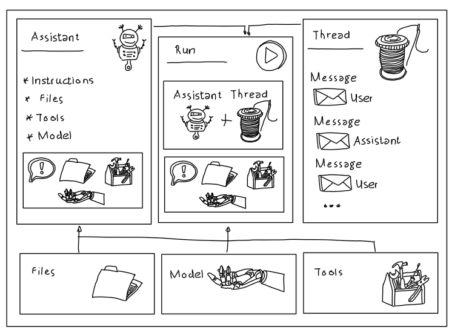
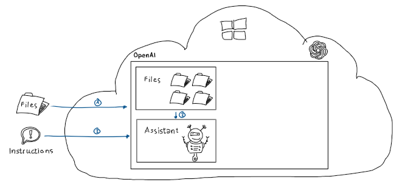
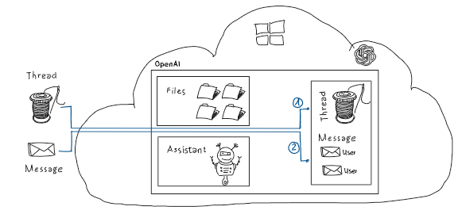
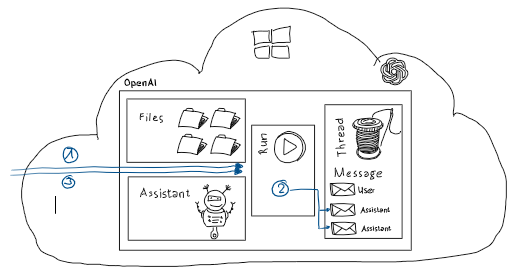
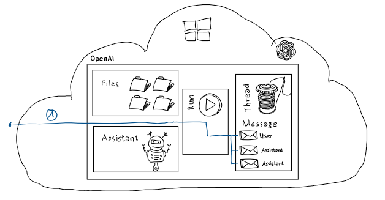

# Azure OpenAI - Assistants API

## Assistants API & Chat Completions API

Azure OpenAI offers two distinct interfaces for completion tasks:

- "Classic" Completion API
- Assistants API.

Each interface or API is designed to cater to different needs and functionalities. 

This paradigm shift from a single call to a structured conversational model enables more complex interactions and greater control over the conversational flow, making Assistants API a powerful tool for building advanced conversational AI systems.

## Assistants, Threads, Messages, Runs, Tools & Files

While the Completion API revolves around a straightforward ChatCompletion call, the Assistants API introduces a more sophisticated approach with concepts like Assistants, Threads and Runs supported by Tools and Files.

The Assistants API allows for the creation of long-lived conversational agents known as Assistants, which can manage multiple conversations concurrently through Threads.

Threads represent individual conversations within an Assistant, and within each Thread, multiple Runs can occur, representing different stages or contexts of the conversation.

The Assistants API introduces the concepts of Files and Tools, where Files support the grounding process by dynamically analyzing provided documents, data, or other content, allowing Assistants to have a richer understanding of the context.

Tools enable the extension of the language model's capabilities with custom functionality, empowering developers to tailor the Assistants to specific use cases or industries. This extensibility facilitates the integration of domain-specific knowledge and workflows.



## Repo Content

The provided [End-to-End Sample](./src/AssistantsAPI_Http_Demo.rest) illustrates how to use the Assistants API for a fictional request to suggest preferred restaurants in a given City for a specific person. All through plain vanilla HTTP requests without relying on a specific SDK.

### Step 1: File Upload & Assistants Creation



1. *Upload local file* using multipart/form-data.
    The file contains the following content:

    ```md
    When Robert is in Berlin he likes Fine Dining with a View!
    
    Berlin offers a diverse culinary scene with various fine dining options. Here's a list of fine dining cuisines you might enjoy during your weekend trip: A list with fantasy restaurant names for different cuisines in Berlin:
     1. **German Cuisine**: 
        - Sample traditional German dishes with a modern twist at fine dining establishments like "Elysium's Hearth" or "Aurora's Feast Hall." - Try classic dishes such as Wiener Schnitzel, Sauerbraten, or Rouladen prepared with a refined touch. 
     2.  **Fine Dining with a View**: 
        - Enjoy panoramic views of Berlin while dining at Michelin-starred restaurants like "Skyward Summit" or "Stellar Heights," where exquisite cuisine is complemented by stunning city vistas. Feel free to use these fantasy names as inspiration for your culinary adventures in Berlin!
    ```

1. *Create Assistant* using the following instruction (system message):

   ```html
    You are an assistant which helps finding people's favorite restaurants in different cities. Don't ask for permission if you need to access information in uploaded files. Just use all information which is provided in uploaded files.
   ```

    ***Attention:*** Please note that the Assistant is created with the 'code-interpreter' tool enabled. This is necessary to allow the Assistant API analyzing the uploaded file and if necessary create analytic code on the fly to retrieve grounding information.

### Step 2: Create Thread and add User Message



1. *Create Thread*
2. *Add User Message* to the thread:

    ```html
    What is Robert's favorite restaurant when he's in Berlin?
    ```

### Step 3: Create Run and Check Status



1. *Create Run* to assign Assistant with instructions to the Thread with the chat history. The "Run" is queued and picked up by the Assistant API for execution.
2. While executed *Assistant Messages are added* to the thread.
3. Thread Status & Thread Intermediate Steps are queried.

### Step 4: Retrieve Messages from Thread



1. As soon as Thread Status equal to "completed" (check step 3 for details) all Assistant Messages can be retrieved from the Thread. The final Assistants Message created by the LLM:

    ```HTML
    "Based on the content of the file, Robert's favorite type of restaurant when he's in Berlin is "Fine Dining with a View." The file mentions fantasy names of restaurants for this category, suggesting that one might enjoy dining at Michelin-starred restaurants like "Skyward Summit" or "Stellar Heights," which offer panoramic views of Berlin along with exquisite cuisine. These names are given as an inspiration for fine dining experiences in Berlin.
    ```

### Step 5: Clean Up

1. Delete created Thread
2. Delete uploaded File
3. Delete created Assistant

## Further Experiments

To see how the Assistant API dynamically attempts to retrieve valuable information to the user message change the content of the uploaded filed e.g., to binary content or content which is not related to the user message and check the Assistant Messages or Execution Steps which can be retrieved from the Thread as shown in Step 3.